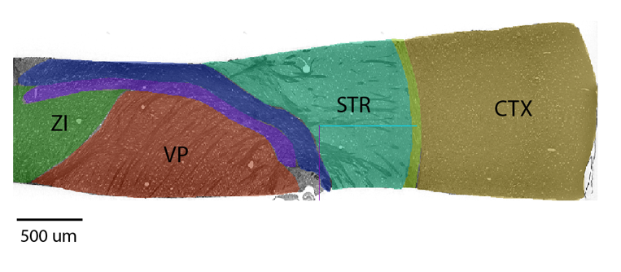

# MTNeuro Benchmark Dataset


## Links 
* [Website](https://mtneuro.github.io/)
* [Bossdb Page](https://bossdb.org/project/prasad2020)

## Overview 
We introduce a new dataset, annotations, and multiple downstream tasks that provide diverse ways to readout information about brain structure and architecture from the same image. Our multi-task neuroimaging benchmark (MTNeuro) is built on volumetric, micrometer-resolution X-ray microtomography imaging of a large thalamocortical section of mouse brain, encompassing multiple cortical and subcortical regions, that reveals dense reconstructions of the underlying microstructure (i.e., cell bodies, vasculature, and axons). We generated a number of different prediction challenges and evaluated several supervised and self-supervised models for brain-region prediction and pixel-level semantic segmentation of microstructures. Our experiments not only highlight the rich heterogeneity of this dataset, but also provide insights into how self-supervised approaches can be used to learn representations that capture multiple attributes of a single image and perform well on a variety of downstream tasks.

This dataset provides some key features for the neuroinformatics processing community:
* Three Dimensional Multi-Scale Annotated Dataset: The 3D x-ray microtomography dataset spans multiple brain areas and includes region of interest (ROI) annotations, densely annotated 3D cutouts, and semantic interpretable features.
* Multi-Level Benchmark Tasks: Benchmark tasks feature both microscopic and macroscopic classification objectives.
* Evaluation of Model Baselines: Both 2D and 3D training regimes are considered when training supervised and unsupervised models.

The data are derived from a unique 3D X-ray microtomography dataset covering areas of mouse cortex and thalamus. At 1.17um isotropic resolution for each voxel, both microsctructure (blood vessels, cell bodies, white matter) and macrostructure labels are available. A detailed overview of the dataset can be found [here](https://bossdb.org/project/prasad2020). 

## Getting started
### Installation
To get started, clone this repository, change into the directory and run 
```
pip install -e ./
```
The code has been tested with
* Python >= 3.8
* PIP == 22.1.2
* torch == 1.11.0
* torchvision == 0.12.0
* numpy == 1.19.3

To get started running examples, files in the scripts directory can be run following this example
```
python3 scripts/task2_main.py
```
and will load default configuration scripts and public authetication credentials. The training script will output trained network weights as a 'pt' file, and produce output figures. 

### Access with Pytorch Dataloader
This is the easiest way to build on the example code for network development. A pytorch dataset is provided [bossdbdataloader](MTNeuro/bossdbdataset.py) and used in our example [scripts](scripts/task2_main.py).

Instructions for adapting our test scripts for a new model are found in [here](docs/Testing_Model.md).

### Access with Jupyter Notebook
Users not using Pytorch can use the data access [notebooks](notebooks/) to pull local copies of the data for each task to use with their preferred framework. The code, by default, saves the cutouts as numpy tensors. 

### Downloading the Dataset
While the data can be downloaded directly from [here](https://bossdb.org/project/prasad2020) using the Intern API (https://pypi.org/project/intern/), the data can be downloaded directly and saved locally using the `download=true` flag in the dataset, which will save the data locally to the specified `download_path`. 

Seperate cutouts are provided for each task and for each split (training, validation, and testing), so each task will contain three associated data files and 3 associated label files. 

## Code structure
* [`MTNeuro`](MTNeuro/) - main code folder
    * [`bossdbdataset.py`](MTNeuro/bossdbdataset.py) - Pytorch dataset
    * [`networkconfig`](MTNeuro/networkconfig/) - JSON configurations for individual network runs
    * [`taskconfig`](MTNeuro/taskconfig/) - JSON configurations for tasks and subtasks
* [`notebooks`](notebooks/) - visualization and download notebooks, no Pytorch required
* [`scripts`](scripts/) - main execution scripts for each task, using Pytorch
* [`docs`](docs/) - additional documentation

## Training Scripts
Code for executing training and evaluation for baseline networks are provided for each task in the [`scripts`](scripts/) folder. 
* Task 1: task1_ssl.py, task1_sup.py (a CUDA enabled graphics card is required for training)
* Task 2: task2_main.py
* Task 3: task3_main.py

These can all be run as `scripts\script_name` from the main repository folder.

These can be reconfigured for different networks using the configuration files in [`networkconfig`](MTNeuro/networkconfig/).

## License 
This software is available under the [MIT License](https://opensource.org/licenses/MIT).  

The original X-ray Microtomography image dataset is licensed under Creative Commons Attribution 4.0 International (CC BY 4.0). 

## Citation
If you find this project useful in your research, please cite the following paper!

* Prasad, J. A., Balwani, A. H., Johnson, E. C., Miano, J. D., Sampathkumar, V., De Andrade, V., ... & Dyer, E. L. (2020). A three-dimensional thalamocortical dataset for characterizing brain heterogeneity. Scientific Data, 7(1), 1-7.